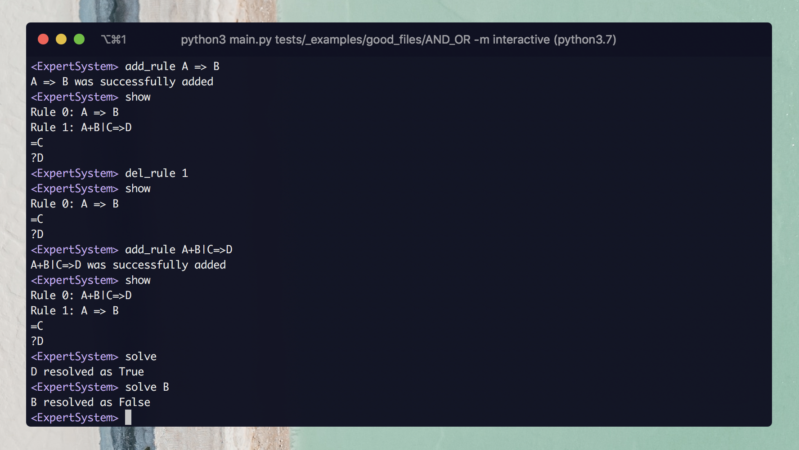

# 42-expert-system

> Python implementation of a backward chaining inference engine.

## Presentation

The project receives an **input file** describing a set of rules, initial facts and queries. It must follows the following format:

```bash
# Example of input file

# Rules and symbols
C => E # C implies E
A + B + C => D # A and B and C implies D
A | B => C # A or B implies C
A + !B => F # A and not B implies F
C | !G => H # C or not G implies H
V ^ W => X # V xor W implies X
A + B => Y + Z # A and B implies Y and Z
C | D => X | V # C or D implies X or V
E + F => !V # E and F implies not V
A + B <=> C # A and B if and only if C
A + B <=> !C # A and B if and only if not C

# Initial facts
= ABG

# Queries
?GVX
```



## Getting started

### Requirements

The project uses `python3.7` and requires to install `graphviz` (for macs, do `brew install graphviz`).

We recommand you to use `virtualenv` to create an independant environment for the project.

```bash
pip3 install virtualenv
cd project-path/
virtualenv venv
source venv/bin/activate
```

Install python dependencies with:

```bash
python3 -m pip install -r requirements.txt
```

You can leave the virtual environment with the command `deactivate`.

### How to use

The program works in two modes: `shell` and `interactive`. For more detail, `python3 main.py -h`.

```bash
usage: main.py [-h] [-m {shell,interactive}] [-g] [-r] [-i] [-s] [-v] input
```

### Testing

```bash
python3 -m pytest -v
```

## Implementation

### Project files structure

```
README.md
/src
    Node.py # Most of the resolver functions are here
    Tree.py
```

### Data structure

A **tree** represents a set of rules. It is composed of nodes divided in 3 types : `ConnectorNode`, `AtomNode` and `NegativeNode`.

```python
ConnectorNode() # One of [+, |, ^, =>]
AtomNode() # Any uppercase letter, ex: A, B
NegativeNode() # Doesn't have an identity, it only represents the negative part 
```

#### The node class

All the node classes are child of a global `Node` class. Each node instance can have **children**. Child represent the left part of the equation. We can deduct that **if a child is true, then its parent is also true**.

#### The atom class

An `AtomNode` represents one fact. It's representation is an uppercase character. Each **atom** must be represented uniquely, meaning that we **must never have any duplication**. For example you will never find two `A` atoms.

```python
AtomNode('A')
```

#### The connector class

A `ConnectorNode` is used to represent one operator in the `ConnectorType` set  ( one of `& | ^`). The elements used for the calculation are saved in the `operands` property.

```python
# Example: Create the (A + B) ConnectorNode

connector_ab = ConnectorNode(ConnectorType.AND)
node_a = AtomNode('A')
node_b = AtomNode('B')

connector_ab.append_operand(node_a)
connector_ab.append_operand(node_b)
```

#### The tree class

The `Tree` class keeps an `AND` operator connected to each of the Atoms in the `root`property. So that we have one tree for the whole set of rules.

#### Equivalence

In the case of an equivalence, both nodes will be parent and child.

```python
# Example: Creates the A <=> B
node_a = AtomNode('A')
node_b = AtomNode('B')
connector_imply = ConnectorNode(ConnectorType.IMPLY)
node_a.append_child(connector_imply)
connector_imply.append_child(node_b)
node_b.append_child(connector_imply)
connector_imply.append_child(node_a)
```

### Handling priorities

We use the NPI notation to handle all operations priorities.
